# 🏦 KYC System - Know Your Customer Management Platform

[](https://www.python.org/downloads/)
[](https://fastapi.tiangolo.com/)
[](https://streamlit.io/)
[](https://azure.microsoft.com/en-us/products/ai-services)
[](https://azure.microsoft.com/en-us/products/ai-services/ai-document-intelligence)
[](https://azure.microsoft.com/en-us/products/ai-services/ai-vision)
[](https://azure.microsoft.com/en-us/products/ai-services/ai-language)
[](LICENSE)
[](CONTRIBUTING.md)

A comprehensive **Know Your Customer (KYC)** management system powered by **Azure AI services** and built with modern Python technologies. This intelligent platform leverages **Azure AI Document Intelligence**, **Azure AI Vision**, **Azure AI Language**, and **Azure Blob Storage** to provide automated document processing, intelligent text extraction, and secure cloud storage for financial institutions.

## ✨ Key Features

### 🔐 **Authentication & Security**

- **Role-Based Access Control** (Customer, Analyst, Admin)
- **JWT Token Authentication** with secure session management
- **Development Authentication System** for easy testing
- **Account Lockout Protection** against brute force attacks

### 📋 **Intelligent Document Management**

- **Azure AI Document Intelligence** - Extract structured data from forms and documents
- **Azure AI Vision** - OCR and document quality assessment
- **Multi-Format AI Processing** (PDF, Images, Scanned Documents)
- **Azure Blob Storage** - Secure, scalable cloud storage with AI processing
- **Automated Document Classification** using Azure AI services
- **Document Versioning** with comprehensive tracking
- **Secure File Upload** with validation and scanning

### 🔍 **AI-Powered KYC Processing**

- **Azure AI Document Intelligence** - Automated document extraction and form recognition
- **Azure AI Vision** - OCR, image analysis and document quality assessment
- **Azure AI Language** - PII detection, entity recognition and sentiment analysis
- **Intelligent Document Processing** - Multi-format support (PDF, Images, Scanned Documents)
- **Real-time Status Tracking** with AI-driven insights
- **Automated Risk Assessment** using AI-powered analysis

### 📊 **Multi-Interface System**

- **Customer Portal** - Document upload and status tracking
- **Analyst Dashboard** - Review and decision-making interface
- **Admin Dashboard** - System management and configuration
- **Secure System Launcher** - Centralized access control

### 🤖 **Azure AI Integration**

- **Azure AI Document Intelligence** - Intelligent form recognition and data extraction
- **Azure AI Vision** - Advanced image analysis and OCR capabilities
- **Azure AI Language** - Natural language processing and entity recognition
- **Azure Blob Storage** - Cloud storage with seamless AI service integration
- **Cognitive Services APIs** - Pre-built AI capabilities for document processing
- **Multi-Service Integration** - Unified Azure AI processing pipeline

### 🎨 **Modern UI/UX**

- **Responsive Design** with modern CSS styling
- **Real-time AI Insights** and notifications
- **Interactive Dashboards** with AI-powered analytics
- **Professional Gradient Themes** for each interface

## 🏗️ System Architecture

### 🎯 **High-Level Architecture Diagram**

```mermaid
graph TB
    %% User Interfaces
    subgraph "🖥️ Frontend Layer"
        CL[🔧 System Launcher<br/>Port 8520]
        CP[👤 Customer Portal<br/>Port 8501]
        AD[📊 Analyst Dashboard<br/>Port 8502]
        AM[⚙️ Admin Dashboard<br/>Port 8503]
    end

    %% API Layer
    subgraph "🔌 API Layer"
        API[⚡ FastAPI Server<br/>Port 8000<br/>JWT Authentication]
    end

    %% Business Logic
    subgraph "🧠 Business Logic"
        US[📤 Upload Service]
        AS[🔍 Analysis Service]
        PS[🛡️ PII Redaction]
        AC[✅ Authenticity Checker]
        NS[📢 Notification Service]
    end

    %% Azure AI Services
    subgraph "🤖 Azure AI Services"
        ADI[📋 Azure AI Document Intelligence<br/>Form Recognition & Data Extraction]
        AV[👁️ Azure AI Vision<br/>OCR & Image Analysis]
        AL[🗣️ Azure AI Language<br/>PII Detection & Entity Recognition]
    end

    %% Storage Layer
    subgraph "💾 Storage Layer"
        ABS[☁️ Azure Blob Storage<br/>Document Storage]
        PG[(🐘 PostgreSQL<br/>Primary Database)]
        SL[(📁 SQLite<br/>Fallback Database)]
        RD[(🔴 Redis<br/>Cache & Sessions)]
    end

    %% Data Flow
    CL --> API
    CP --> API
    AD --> API
    AM --> API

    API --> US
    API --> AS
    API --> PS
    API --> AC
    API --> NS

    US --> ABS
    AS --> ADI
    AS --> AV
    PS --> AL
    AC --> ADI
    AC --> AV

    API --> PG
    API --> SL
    API --> RD
    ABS --> ADI
    ABS --> AV

    %% Styling
    classDef frontend fill:#e1f5fe,stroke:#01579b,stroke-width:2px
    classDef api fill:#f3e5f5,stroke:#4a148c,stroke-width:2px
    classDef business fill:#e8f5e8,stroke:#1b5e20,stroke-width:2px
    classDef azure fill:#fff3e0,stroke:#e65100,stroke-width:2px
    classDef storage fill:#fce4ec,stroke:#880e4f,stroke-width:2px

    class CL,CP,AD,AM frontend
    class API api
    class US,AS,PS,AC,NS business
    class ADI,AV,AL azure
    class ABS,PG,SL,RD storage
```



### 🔄 **Document Processing Flow**

```mermaid
sequenceDiagram
    participant C as 👤 Customer
    participant CP as 🖥️ Customer Portal
    participant API as ⚡ FastAPI
    participant ABS as ☁️ Azure Blob Storage
    participant ADI as 📋 Azure Document Intelligence
    participant AV as 👁️ Azure Vision
    participant AL as 🗣️ Azure Language
    participant DB as 🐘 Database
    participant A as 📊 Analyst

    Note over C,A: Document Upload & AI Processing Workflow

    C->>CP: Upload KYC Document
    CP->>API: POST /upload (JWT Auth)
    API->>ABS: Store Original Document

    par Parallel AI Processing
        API->>ADI: Extract Form Data
        ADI-->>API: Structured Data + Confidence
    and
        API->>AV: OCR + Quality Analysis
        AV-->>API: Text + Image Quality Score
    and
        API->>AL: PII Detection + Entities
        AL-->>API: Detected PII + Entity List
    end

    API->>DB: Store Analysis Results
    API->>ABS: Store Processed Document
    API-->>CP: Processing Complete
    CP-->>C: Status Update + Document ID

    Note over A,DB: Analyst Review Process
    A->>API: GET /documents/pending
    API->>DB: Fetch Pending Reviews
    DB-->>API: Document List + AI Insights
    API-->>A: Documents with AI Analysis

    A->>API: POST /review/decision
    API->>DB: Update Document Status
    API->>C: Notification (Approved/Rejected)
```



### 📁 **Project Structure**

```
KYC System/
├── 🔧 Backend (FastAPI)
│   ├── src/api/           # REST API endpoints
│   ├── src/auth/          # JWT authentication services
│   ├── src/models/        # Data models & database schemas
│   ├── src/services/      # Azure AI service integrations
│   │   ├── blob_storage.py      # Azure Blob Storage
│   │   ├── upload_service.py    # Document upload handling
│   │   ├── pii_redaction.py     # Azure AI Language integration
│   │   └── authenticity_checker.py # Azure AI Document Intelligence
│   └── src/database/      # Database configuration & models
├── 🖥️ Frontend (Streamlit)
│   ├── src/ui/customer_portal.py    # Customer interface
│   ├── src/ui/analyst_dashboard.py  # Analyst review interface
│   ├── src/ui/admin_dashboard.py    # System administration
│   └── src/ui/secure_launcher.py    # Authentication & launcher
├── 🧪 Testing & Validation
│   ├── tests/             # Comprehensive test suite
│   ├── test_*.py          # Integration & unit tests
│   └── debug_*.py         # Development utilities
└── 🚀 Configuration & Deployment
    ├── .env.example       # Environment configuration template
    ├── requirements.txt   # Python dependencies
    └── README.md         # This documentation
```

## 🚀 Quick Start

### Prerequisites

- **Python 3.8+**
- **PostgreSQL** (optional - SQLite fallback included)
- **Redis** (optional - for caching)
- **Azure Account** (optional - for cloud storage)

### Installation

1. **Clone the repository**

   ```bash
   git clone https://github.com/Antonio-Ngbesu/KYC-Management-System.git
   cd KYC-Management-System
   ```

2. **Create virtual environment**

   ```bash
   python -m venv venv
   # Windows
   venv\Scripts\activate
   # Linux/Mac
   source venv/bin/activate
   ```

3. **Install dependencies**

   ```bash
   pip install -r requirements.txt
   ```

4. **Environment setup** (optional)
   ```bash
   # Create your own .env file with your Azure credentials
   # See documentation for required environment variables
   ```

### 🎯 Running the System

#### Option 1: Secure Launcher (Recommended)

```bash
streamlit run secure_launcher.py --server.port 8520
```

- Navigate to: http://localhost:8520
- Login with demo credentials (see below)
- Launch services from the web interface

#### Option 2: Manual Launch

```bash
# API Server
cd src && python -m uvicorn api.main:app --reload --port 8000

# Customer Portal
streamlit run src/ui/customer_portal.py --server.port 8501

# Analyst Dashboard
streamlit run src/ui/analyst_dashboard.py --server.port 8502

# Admin Dashboard
streamlit run src/ui/admin_dashboard.py --server.port 8503
```

### 🔐 Demo Credentials

| Role         | Username            | Password  | Access Level                        |
| ------------ | ------------------- | --------- | ----------------------------------- |
| **Customer** | `customer@demo.com` | `demo123` | Document upload, status tracking    |
| **Analyst**  | `analyst@demo.com`  | `demo123` | Document review, risk assessment    |
| **Admin**    | `admin@demo.com`    | `demo123` | Full system access, user management |

## 🌐 Access Points

| Service               | URL                        | Description                                |
| --------------------- | -------------------------- | ------------------------------------------ |
| **System Launcher**   | http://localhost:8520      | Secure authentication & service management |
| **Customer Portal**   | http://localhost:8501      | Customer document submission               |
| **Analyst Dashboard** | http://localhost:8502      | KYC review and processing                  |
| **Admin Dashboard**   | http://localhost:8503      | System administration                      |
| **API Documentation** | http://localhost:8000/docs | Interactive API docs (Swagger)             |

## 🧪 Testing

### Run Test Suite

```bash
# All tests
python -m pytest tests/ -v

# Specific test categories
python test_api_health.py           # API health checks
python test_storage.py              # Storage system tests
python test_upload_system.py        # Upload functionality
python test_all_services.py         # End-to-end tests
```

### Development Testing

```bash
# Authentication system
streamlit run auth_test.py --server.port 8510

# Connection debugging
python debug_connection.py

# Working process demo
python demo_working_process.py
```

## 📦 Technology Stack

### **Azure AI Services**

- **Azure AI Document Intelligence** - Intelligent document processing and form recognition
- **Azure AI Vision** - Image analysis and optical character recognition
- **Azure AI Language** - Natural language processing and sentiment analysis
- **Azure Blob Storage** - Cloud storage with AI processing integration

### **Backend**

- **FastAPI** - High-performance async API framework with Azure AI integration
- **SQLAlchemy** - Database ORM with async support
- **Alembic** - Database migration management
- **PostgreSQL** - Primary database (SQLite fallback)
- **Redis** - Caching and session storage
- **Uvicorn** - ASGI server

### **Frontend**

- **Streamlit** - Interactive web applications powered by Azure AI
- **Modern CSS** - Responsive design with gradients
- **JavaScript Integration** - Enhanced interactivity with AI insights

### **Security & Auth**

- **JWT Tokens** - Secure authentication
- **BCrypt** - Password hashing
- **python-jose** - JWT handling
- **Passlib** - Password utilities

### **Storage & Integration**

- **Azure Blob Storage** - Cloud document storage with AI processing
- **PostgreSQL/SQLite** - Flexible database support
- **File Upload Validation** - Security scanning and validation
- **Redis Caching** - Session management and performance optimization

## 🔒 Security Features

- ✅ **Authentication Required** for all sensitive operations
- ✅ **Role-Based Access Control** with granular permissions
- ✅ **JWT Token Management** with expiration handling
- ✅ **Account Lockout Protection** against brute force
- ✅ **Secure File Upload** with validation and scanning
- ✅ **Audit Logging** for compliance and monitoring
- ✅ **Data Encryption** in transit and at rest
- ✅ **Session Management** with automatic cleanup

## 🤝 Contributing

We welcome contributions! Please see our [Contributing Guidelines](CONTRIBUTING.md) for details.

1. Fork the repository
2. Create a feature branch (`git checkout -b feature/amazing-feature`)
3. Commit your changes (`git commit -m 'Add amazing feature'`)
4. Push to the branch (`git push origin feature/amazing-feature`)
5. Open a Pull Request

## 📋 Roadmap

- [ ] **Machine Learning Integration** - AI-powered document analysis
- [ ] **Mobile Application** - Native iOS/Android apps
- [ ] **API Rate Limiting** - Enhanced security controls
- [ ] **Advanced Analytics** - Business intelligence dashboard
- [ ] **Multi-tenant Support** - SaaS deployment options
- [ ] **Blockchain Integration** - Immutable audit trails
- [ ] **Advanced Reporting** - Compliance and regulatory reports

## 📄 License

This project is licensed under the MIT License - see the [LICENSE](LICENSE) file for details.

## 🆘 Support

- **Documentation**: Check the `/docs` folder for detailed guides
- **Issues**: Report bugs via GitHub Issues
- **Discussions**: Join our GitHub Discussions for questions
- **Email**: [support@kyc-system.com](mailto:support@kyc-system.com)

## 🏆 Acknowledgments

- Built with ❤️ using modern Python ecosystem
- Inspired by financial industry best practices
- Community-driven development approach

---

**⭐ Star this repository if you find it helpful!**


